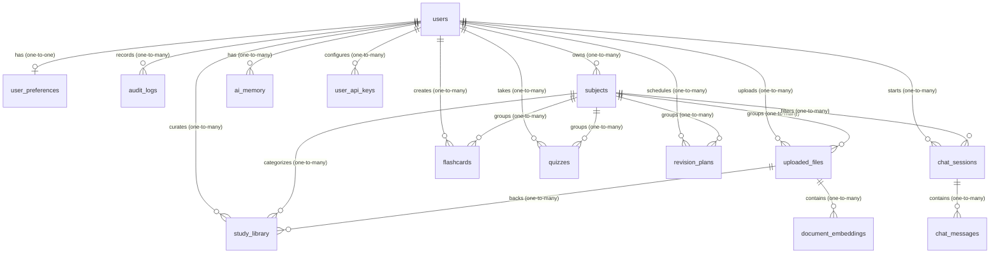

# Database Relationships & Entity-Relationship Specifications

This document outlines the entity-relationship specifications, foreign key constraints, deletion cascade configurations, and overall cardinality of the StudyMate AI Supabase architecture.

## Visual ER Diagram

## Entity-Relationship Diagram (Mermaid)

## Detailed Relationship Specifications

### 1. User Domain Links
- **`user_preferences`**: Linked to `users` via `id UUID PRIMARY KEY REFERENCES public.users(id) ON DELETE CASCADE`. This forms a strict 1-to-1 relationship, ensuring that deleting a user completely removes their preferences.
- **`audit_logs`**: Linked to `users` via `user_id UUID REFERENCES public.users(id) ON DELETE SET NULL`. If a user is deleted, their security log trail remains intact with a NULL user identifier to maintain system audit integrity.
- **`user_api_keys`**: Linked to `users` via `owner_id UUID REFERENCES public.users(id) ON DELETE CASCADE`. If a user is deleted, their encrypted credentials are removed. A unique constraint ensures `(owner_id, provider)` uniqueness.

### 2. Subject Domain Links
- **`subjects`**: Owned by `users` via `owner_id UUID REFERENCES public.users(id) ON DELETE CASCADE`.
- **`uploaded_files`**: Linked to `users` via `owner_id` (cascade delete) and `subjects` via `subject_id UUID REFERENCES public.subjects(id) ON DELETE CASCADE`.
- **`study_library`**: References `uploaded_files` via `uploaded_file_id UUID REFERENCES public.uploaded_files(id) ON DELETE SET NULL`. This ensures library items remain active even if the backing file is deleted (allowing text preview retention or plain-text versions).

### 3. AI Conversation Domain Links
- **`chat_sessions`**: References `owner_id` (cascade delete) and `subject_id` (on delete set null, meaning a session isn't deleted if its subject category is deleted).
- **`chat_messages`**: References `session_id` via `session_id UUID REFERENCES public.chat_sessions(id) ON DELETE CASCADE`. All messages are cleaned up when their parent session is removed.

### 4. Embedding & Search Domain Links
- **`document_embeddings`**: References `uploaded_files` via `uploaded_file_id UUID REFERENCES public.uploaded_files(id) ON DELETE CASCADE`. Deleting a document instantly wipes its corresponding high-dimensional vector chunks.
